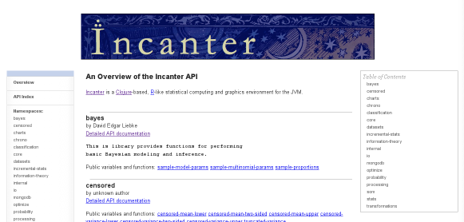
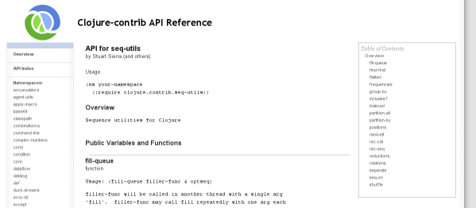
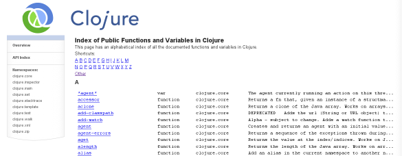

Autodoc - an automated documentation system for Clojure
=======================================================

Introduction
------------

Autodoc is a system for generating HTML documentation for Clojure
projects. It is used to create the up-to-the minute published API
documentation for [Clojure
itself](http://richhickey.github.com/clojure), 
the [Clojure-contrib
library](http://richhickey.github.com/clojure-contrib), and the
statistics package, [Incanter](http://liebke.github.com/incanter).

Autodoc has been created by Tom Faulhaber.

Autodoc leverages two aspects of Clojure in particular:

* Clojure projects are organized into namespaces.
* Clojure supports documentation strings on all variables (including functions
  and macros) and namespaces.

When run over a project, Autodoc will generate:

1. An overview page (called index.html) with a description of the
project, and an overview of each namespace (from the namespace's
metadata) with a list of documented, public variables and functions in
that namespace. 

    

2. A page for each namespace in the project which has the detailed
documentation for each variable, function and macro. This includes
name, type, usage and documentation. 

    

3. A global index of all the documented variables, their namespace,
and a snippet of their documentation. 

    

By default, Autodoc produces documentation that looks a lot like
Clojure's own API documentation. However, it is possible to customize
both the style and layout of the pages generated by Autodoc to your
tastes.

Autodoc can be run directly from the command line or can be used from
build tools like ant or
[leiningen](http://github.com/technomancy/leiningen).

### Things not yet implemented ###

Most of the features of the Autodoc service have been implemented in
the Autodoc command. A couple of features are not set up yet, however:

* Building and linking supporting documentation from Markdown source. 
* Automatically updating a GitHub pages repository as part of the
* build. (See below for a more manual solution to this, however.)

Stay tuned. These features are coming.

Autodoc continues to evolve. If there are features you'd like to see,
let me know.

Adding Documentation to your Project
------------------------------------

Autodoc uses Clojure's metadata mechanism to find documentation that
you've built into your Clojure programs. Autodoc uses the same doc
strings that the regular Clojure documentation system uses and adds
some extra functionality as well.

Autodoc reads metadata attached to namespaces and vars. Since defined
functions are a type of var, their doc strings and other metadata are
included automatically.

Every Clojure namespace and var has a Clojure map for it's
metadata. Metadata is generally added when you use the `ns` macro or
the `def` macro (or one of its relatives such as `defn`).

Autodoc uses the following keys in these maps:

<table>
<thead>
<tr>
<td>
Metadata key
</td>
<td>
Use
</td>
<td>
Namespace or Def
</td>
</tr>
</thead>

<tr>
<td>
:arglists
</td>
<td>
A list of the allowed argument lists for a function. The <code>defn</code> and
<code>defmacro</code> macros will add this automatically. You may want to add
this manually to <code>defmulti</code> to get the same effect.
</td>
<td>
Def
</td>
</tr>

<tr>
<td>
:author
</td>
<td>
A string with the author of this namespace. Used to attribute the
namespace when muliple authors have worked on a project.
</td>
<td>
Namespace
</td>
</tr>

<tr>
<td>
:file
</td>
<td>
Used to create the source link when autodoc has a defined source
repository to link to. This key is generated automatically by <code>def</code> and
its related macros.
</td>
<td>
Def
</td>
</tr>

<tr>
<td>
:line
</td>
<td>
Used to create the source link. See <code>:file</code>.
</td>
<td>
Def
</td>
</tr>

<tr>
<td>
:macro 
</td>
<td>
Used to determine the type of the symbol. If the var has a <code>:macro</code>
key, it is assumed to be a macro. This key is added automatically by <code>defmacro</code>. 
</td>
<td>
Def
</td>
</tr>

<tr>
<td>
:see-also
</td>
<td>
A list of titles and URLs for related documents. These can either be
documents built as part of the Autodoc process or links to external
references on the web.
</td>
<td>
Namespace
</td>
</tr>

<tr>
<td>
:skip-wiki
</td>
<td>
If non-nil, skip this namespace or var.
</td>
<td>
Both
</td>
</tr>

<tr>
<td>
:tag
</td>
<td>
Determines whether the var is a multimethod. <code>defmulti</code> sets this
automatically (though there are plans to change this to a different key).
</td>
<td>
Def
</td>
</tr>
</table>

Running Autodoc
---------------

### Getting Autodoc ###

Unless you are using Autodoc from leiningen, you will need to get a
copy of the standalone jar. Download the latest version from 
[github](http://github.com/tomfaulhaber/autodoc/downloads).

If you're using leiningen, the autodoc code will be pulled
automatically from its home on clojars.org.

### From the command line ###

The simplest way to use autodoc is to launch it from the command line
in the root directory of your project:

    java -jar autodoc-<version>-standalone.jar 

This will scan the source in the `src/` directory and produce an
HTML tree in `autodoc/` directory.

To modify the behavior of autodoc, use parameters. For example:

    java -jar autodoc-<version>-standalone.jar --source-directory=master

will use the sub-directory `master/` as the location of the source
files.

As shown above, to set parameters from the command line, simply use
options like `--<parameter-name>=<value>` or `--<parameter-name>
<value>`. The full list of available parameters is below.

If you need extra classpath entries (that is, if your project uses a
library other than Clojure or Clojure-Contrib), you won't be able to
run the executable jar directly. Instead, specify your full classpath
and the class `autodoc.autodoc` as follows:

    java -cp autodoc-<version>-standalone.jar:<other jars> autodoc.autodoc <autodoc params>

### Autodoc parameters ###

<table>
<thead>
<tr>
<td>
Parameter
</td>
<td>
Description
</td>
<td>
Default Value
</td>
</tr>
</thead>

<tr>
<td>
name 
</td>
<td>
The name of this project
</td>
<td>
Taken from the directory name where autodoc is running
</td>
</tr>
<tr>

<td>
description
</td>
<td>
A description of this project
</td>
<td>
nil 
</td>
</tr>

<tr>
<td>
param-dir 
</td>
<td>
A directory from which to load custom project data
</td>
<td>
autodoc-params 
</td>
</tr>

<tr>
<td>
root 
</td>
<td>
The directory in which to find the project
</td>
<td>
. 
</td>
</tr>

<tr>
<td>
source-path 
</td>
<td>
The relative path within the project directory where we find the source
</td>
<td>
src
</td>
</tr>

<tr>
<td>
web-src-dir 
</td>
<td>
The web address for source files (e.g., http://github.com/richhickey/clojure/blob/)
</td>
<td>
nil 
</td>
</tr>

<tr>
<td>
web-home 
</td>
<td>
Where these autodoc pages will be stored on the web (for gh-pages, http://&lt;user&gt;.github.com/&lt;project&gt;/)
</td>
<td>
nil
</td>
</tr>

<tr>
<td>
output-path 
</td>
<td>
Where to create the output html tree.
</td>
<td>
autodoc 
</td>
</tr>

<tr>
<td>
external-doc-tmpdir 
</td>
<td>
The place to store temporary doc files during conversion (i.e., when converting markdown).
</td>
<td>
/tmp/autodoc/doc 
</td>
</tr>

<tr>
<td>
namespaces-to-document 
</td>
<td>
The list of namespaces to include in the documentation, separated by commas
</td>
<td>
nil 
</td>
</tr>

<tr>
<td>
trim-prefix 
</td>
<td>
The prefix to trim off namespaces in page names and references (e.g. "clojure.contrib")
</td>
<td>
nil 
</td>
</tr>

<tr>
<td>
load-except-list 
</td>
<td>
A list of regexps that describe files that shouldn't be loaded
</td>
<td>
[]
</td>
</tr>

<tr>
<td>
build-json-index 
</td>
<td>
Set to true if you want to create an index file in JSON (currently slow)
</td>
<td>
false 
</td>
</tr>

<tr>
<td>
page-title 
</td>
<td>
A title to put on each page
</td>
<td>
nil 
</td>
</tr>

<tr>
<td>
copyright 
</td>
<td>
Copyright (or other page footer data) to put at the bottom of each page
</td>
<td>
No copyright info 
</td>
</tr>
</table>

Integrating Autodoc with your build
-----------------------------------

### Building with Leiningen ###

Autodoc works as a plug-in for Leiningen. This is the very easiest way
to integrate Autodoc into a build process.

Simply add a dev-dependency to your project.clj file:

    :dev-dependencies [[autodoc "0.7.0-SNAPSHOT"]]

Leiningen will automatically pull the code for the autodoc plug-in
from Clojars, so you don't need to worry about installing or anything.

To build the documenation, simply type:

    lein autodoc

Autodoc will set the name, description, and source-path parameters
from the Leiningen configuration. Other parameters can be set via a
map attached to the `:autodoc` key:


    (defproject bugs "0.1.0-SNAPSHOT"
      :description "Statistical routines for thinking about a bugzilla DB"
      :dependencies [[incanter "1.0-master-SNAPSHOT"]
                     [org.clojure/clojure "1.1.0-alpha-SNAPSHOT"]
                     [org.clojure/clojure-contrib "1.0-SNAPSHOT"]]
      :dev-dependencies [[autodoc "0.7.0-SNAPSHOT"]]
      :autodoc { :name "Bugs", :page-title "Bugs API Documentation"})


 
### Building with Ant ### 

Building with ant is straightforward. Just add an autodoc target to
your `build.xml` file that looks like this:

    <!-- Adjust the pathname of the jar to wherever you've stored it and set the version appropriately -->
    <property name="autodoc-standalone-jar" location="${user.home}/.clojure/autodoc-<version>-standalone.jar"/>
  
    <!-- Adjust the depends as appropriate -->
    <target name="autodoc" depends="build"
            description="Build the HTML documentation">
  		<java classname="autodoc.autodoc" fork="true" failonerror="true">
        <classpath>
          <pathelement location="${autodoc-standalone-jar}"/>
          <!-- other pathelements as required by the project -->
        </classpath>
        <arg value="--name=Bugs"/>
        <arg value="--description=Statistical routines for thinking about a bugzilla DB"/>
        <arg value="--page-title=Bugs API Documentation"/>
      </java>
    </target>

The comments refer to the parts that will have to change depending on
the configuration of your build system.

### Maven ###

Autodoc currently does not support Maven. It is planned, though. Patches welcome.

Making Autodoc work with source code management
-----------------------------------------------

Many users will want the files generated by Autodoc to be excluded
in their code repositories. This is easy to do in most SCMs.

For example, in git, create a `.gitignore` file in the root directory
of the project with the following lines:

    #ignore generated autodoc files
    autodoc/**

Other SCMs support similar mechanisms.

### Publishing your documentation on GitHub using GitHub Pages ###

When the project is using GitHub for sharing source, GitHub pages
provide a great way to share documentation. This is how the Clojure
core API documentation is hosted at
<http://richhickey.github.com/clojure>, for instance.

See <http://pages.github.com/> for a complete description of GitHub
pages and how they work.

Setting up your Autodoc output to link to the GitHub pages for your
project is easy:

1. Add `autodoc/**` to your `.gitignore` file as described above.

2. remove any `autodoc` directory that you've already generated.

3. While in your project root directory, create a clone of your
private github repository into the autodoc directory: 

        git clone git@github.com:<user name>/<project name>.git autodoc

4. Create a new root branch in autodoc with the name `gh-pages`:

        $ cd autodoc
        $ git symbolic-ref HEAD refs/heads/gh-pages
        $ rm .git/index
        $ git clean -fdx
        $ cd ..

5. Now build the autodoc using the command line, Leiningen, ant or
your preferred build tool.

6. Commit the documentation to GitHub with this set of commands:

        $ cd autodoc
        $ git add -A
        $ git commit -m"Documentation update"
        $ git push origin gh-pages

Now, after a few minutes, you should be able to go to `http://<user name>.github.com/<project name>`
and see your documenation rendered for the whole world to see. (Once
in a while I've had to create an extra checkin to kick GitHub when it
didn't notice my first checkin.

Now that you have GitHub pages set up, updating them is
straightforward:

1. Build the autodoc with your normal method.
2. Commit your changes:

        $ cd autodoc
        $ git add -A
        $ git commit -m"Documentation update"
        $ git push origin gh-pages

Customizing Autodoc
-------------------

Autodoc supports customization of page layout, styles and graphical
elements.

You can add customized layout templates and styles in the
`autodoc-params` directory of your project.

More documentation about customizing will be coming soon.
